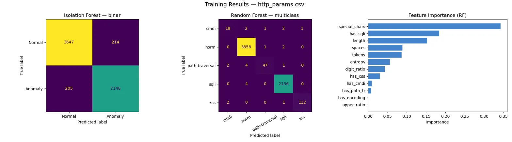
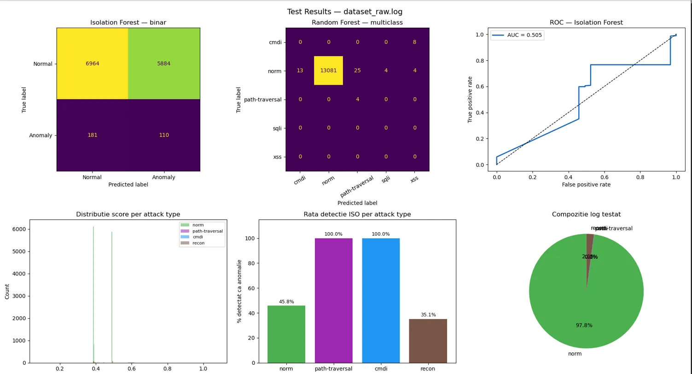

Sistem de detecție a atacurilor web în timp real, bazat pe analiza logurilor de server cu algoritmi de Machine Learning.

---

##  Descriere

Scopul principal este să analizeze traficul web și să diferențieze vizitatorii legitimi de actorii malițioși care încearcă atacuri de tip SQL Injection (SQLi), Cross-Site Scripting (XSS), Path Traversal sau Command Injection.

### Arhitectură

Un server web **Nginx** înregistrează tot traficul. Traficul normal este simulat prin scripturi PowerShell, iar atacurile controlate sunt generate cu **OWASP ZAP**. Logurile colectate sunt procesate de scripturi Python care extrag caracteristici (_features_) din fiecare cerere — lungimea payload-ului, proporția de cifre, numărul de caractere speciale, entropie etc.

Pe baza acestor date, sunt utilizați doi algoritmi:

| Model | Tip | Funcție |
|---|---|---|
| **Isolation Forest** | Detecție anomalii | Marchează cererile ca `Normal` sau `Anomaly`, fără a cunoaște tipul exact de atac |
| **Random Forest** | Clasificator multiclasă | Antrenat pe `http_params.csv` pentru a recunoaște și eticheta exact tipul atacului (ex: `XSS`) |

---

##  Componente Software

- **Docker & Docker Compose** — rularea serverului web și a scannerului OWASP ZAP
- **Miniconda / Anaconda** — mediul de execuție Python și librăriile de Data Science
- **PowerShell** — automatizarea generării de trafic

---

##  Instalare Mediu ML (Miniconda)

```powershell
# Creare mediu virtual
conda create -n mllogs python=3.10 -y
conda activate mllogs

# Instalare dependențe
conda install pandas scikit-learn matplotlib -y
```

---

##  Ghid de Utilizare

### Pasul 1 — Pornirea Infrastructurii

Din folderul proiectului, pornește containerele Docker:

```bash
docker-compose up -d
```

---

### Pasul 2 — Generarea Traficului și Logurilor

**Trafic normal** — simularea utilizatorilor legitimi:

```powershell
powershell -ExecutionPolicy Bypass -File normal_traffic.ps1
```

**Atacuri (Security Scan)** — generarea anomaliilor cu OWASP ZAP:

```bash
# Pregătire director de lucru
docker exec website-zap-scanner-1 mkdir -p /zap/wrk

# Scan de bază (rulează o dată pentru test, o dată pentru train)
docker exec website-zap-scanner-1 zap-baseline.py -t http://web-server

# Scan complet (rulează o dată pentru train)
docker exec website-zap-scanner-1 zap-full-scan.py -t http://web-server
```

**Simulare adițională de trafic normal:**

```powershell
powershell -ExecutionPolicy Bypass -File normal_traffic2.ps1
```

---

### Pasul 3 — Extragerea Logurilor

```bash
docker logs website-web-server-1 > dataset_train.log
docker logs website-web-server-1 > dataset_test.log
```

> **Notă:** Logurile folosite pentru antrenare/testare sunt deja incluse în repository. Pașii de mai sus sunt necesari doar dacă se dorește generarea unor loguri noi.

---

### Pasul 4 — Antrenare și Testare Model ML

**Antrenare** — crearea modelelor pe baza datasetului generic:

```bash
python train_model.py --csv http_params.csv
```

Fișiere generate: `model_iso.pkl`, `model_rf.pkl`, `training_results.png`

**Testare pe date reale** — analiza logurilor colectate de la serverul Nginx:

```bash
python test_on_logs.py --log dataset_raw.log
```

Fișiere generate: `predictions.csv` și graficele de performanță în timp real.

---

## 📊 Rezultate

### Antrenare pe `http_params.csv` (31.067 rânduri)

**Distribuție clase:**

| Clasă | Exemple |
|---|---|
| `norm` | 19.304 |
| `sqli` | 10.852 |
| `xss` | 532 |
| `path-traversal` | 290 |
| `cmdi` | 89 |

#### Isolation Forest — binar (norm vs anomaly)

| Clasă | Precision | Recall | F1-Score | Support |
|---|---|---|---|---|
| normal | 0.95 | 0.94 | 0.95 | 3.861 |
| anomaly | 0.91 | 0.91 | 0.91 | 2.353 |
| **accuracy** | | | **0.93** | 6.214 |
| macro avg | 0.93 | 0.93 | 0.93 | 6.214 |
| weighted avg | 0.93 | 0.93 | 0.93 | 6.214 |

#### Random Forest — multiclass (tip atac)

| Clasă | Precision | Recall | F1-Score | Support |
|---|---|---|---|---|
| `cmdi` | 0.82 | 0.75 | 0.78 | 24 |
| `norm` | 1.00 | 1.00 | 1.00 | 3.861 |
| `path-traversal` | 0.96 | 0.87 | 0.91 | 54 |
| `sqli` | 1.00 | 1.00 | 1.00 | 2.160 |
| `xss` | 0.99 | 0.97 | 0.98 | 115 |
| **accuracy** | | | **1.00** | 6.214 |
| macro avg | 0.95 | 0.92 | 0.93 | 6.214 |
| weighted avg | 1.00 | 1.00 | 1.00 | 6.214 |

---

### Testare pe `dataset_raw.log` (13.139 requesturi)

**Ground truth:**

| Tip | Exemple |
|---|---|
| `norm` | 12.848 |
| `recon` | 279 |
| `cmdi` | 8 |
| `path-traversal` | 4 |

#### Isolation Forest — binar (norm vs anomaly)

| Clasă | Precision | Recall | F1-Score | Support |
|---|---|---|---|---|
| normal | 0.97 | 0.54 | 0.70 | 12.848 |
| anomaly | 0.02 | 0.38 | 0.04 | 291 |
| **accuracy** | | | **0.54** | 13.139 |
| macro avg | 0.50 | 0.46 | 0.37 | 13.139 |
| weighted avg | 0.95 | 0.54 | 0.68 | 13.139 |

#### Random Forest — multiclass (tip atac)

| Clasă | Precision | Recall | F1-Score | Support |
|---|---|---|---|---|
| `cmdi` | 0.00 | 0.00 | 0.00 | 8 |
| `norm` | 1.00 | 1.00 | 1.00 | 13.127 |
| `path-traversal` | 0.14 | 1.00 | 0.24 | 4 |
| `sqli` | 0.00 | 0.00 | 0.00 | 0 |
| `xss` | 0.00 | 0.00 | 0.00 | 0 |
| **accuracy** | | | **1.00** | 13.139 |
| macro avg | 0.23 | 0.40 | 0.25 | 13.139 |
| weighted avg | 1.00 | 1.00 | 1.00 | 13.139 |


---

##  Grafuri




