Se utilizează Machine Learning pentru monitorizarea și detectarea atacurilor web în timp real. Sistemul analizează logurile unui server Nginx (care rulează o aplicație PHP) și identifică anomalii sau atacuri cunoscute: SQLi, XSS, Path Traversal și Command Injection.

---

## Cerințe de Sistem

- **Docker Desktop** — orchestrarea serviciilor Web (Nginx), Backend (PHP) și Security (OWASP ZAP)
- **Miniconda / Anaconda** — mediul de execuție Machine Learning
- **PowerShell** — automatizarea traficului legitim

---

## 1. Configurare Mediu Python

```powershell
conda create -n mllogs python=3.10 -y
conda activate mllogs
conda install pandas scikit-learn matplotlib -y
```

---

## 2. Infrastructură

Proiectul rulează într-o rețea izolată cu trei componente principale:

- **web-server** — Nginx configurat cu un format de logare detaliat
- **php** — backend-ul care procesează cererile aplicației
- **zap-scanner** — scannerul de securitate care simulează atacurile

```bash
docker-compose up -d
```

---

## 3. Generarea Datelor

Logurile trebuie generate urmând o metodologie clară de separare a datelor de antrenament de cele de test.

### A. Log de Antrenament (`dataset_train_v2.log`)

Acest set învață modelele cum arată atât traficul normal, cât și atacurile intense.

```powershell
# Trafic normal
powershell -ExecutionPolicy Bypass -File normal_traffic.ps1

# Scan pasiv
docker exec website-zap-scanner-1 zap-baseline.py -t http://web-server

# Atacuri susținute — rulează de 3 ori
docker exec website-zap-scanner-1 zap-full-scan.py -t http://web-server

# Extragere log
docker logs website-web-server-1 > dataset_train_v2.log
```

### B. Log de Testare (`dataset_test_v2.log`)

Verifică dacă modelul produce alarme false pe trafic curat sau scanări pasive. Se recomandă golirea logurilor containerului înainte de acest pas.

```powershell
# Trafic normal
powershell -ExecutionPolicy Bypass -File normal_traffic.ps1

# Scan pasiv
docker exec website-zap-scanner-1 zap-baseline.py -t http://web-server

# Extragere log
docker logs website-web-server-1 > dataset_test_v2.log
```

---

## 4. Analiză și Detecție

Proiectul include trei scripturi de analiză cu capabilități diferite.

### `anomaly_detector.py` — Pipeline de bază

Extrage features și evaluează traficul. Suportă 4 combinații de antrenare și testare:

```powershell
# 1. Antrenează pe CSV, testează pe CSV
python anomaly_detector.py --train-csv payload_train.csv --test-csv payload_test.csv --output exp1_csv_csv

# 2. Antrenează pe CSV, testează pe LOG
python anomaly_detector.py --train-csv payload_train.csv --test-log dataset_test_v2.log --output exp2_csv_log

# 3. Antrenează pe LOG, testează pe LOG
python anomaly_detector.py --train-log dataset_train_v2.log --test-log dataset_test_v2.log --output exp3_log_log

# 4. Antrenează pe LOG, testează pe CSV
python anomaly_detector.py --train-log dataset_train_v2.log --test-csv payload_test.csv --output exp4_log_csv
```

### `anomaly_detector_threshold.py` — Cu optimizare threshold

Extinde pipeline-ul de bază cu calibrarea automată a pragului de decizie al Isolation Forest folosind strategia `f1`, `precision` sau `recall`. Suportă aceleași 4 combinații plus modul `MIXED`:

```powershell
# Exp 1 — CSV => CSV
python anomaly_detector_threshold.py --train-csv payload_train.csv --test-csv payload_test.csv --output exp1_tuned --threshold f1

# Exp 2 — CSV => LOG
python anomaly_detector_threshold.py --train-csv payload_train.csv --test-log dataset_test_v2.log --output exp2_tuned --threshold f1

# Exp 3 — LOG => LOG
python anomaly_detector_threshold.py --train-log dataset_train_v2.log --test-log dataset_test_v2.log --output exp3_tuned --threshold f1

# Exp 4 — LOG => CSV
python anomaly_detector_threshold.py --train-log dataset_train_v2.log --test-csv payload_test.csv --output exp4_tuned --threshold f1

# Exp 5a — MIXED => CSV
python anomaly_detector_threshold.py --train-mixed-csv payload_train.csv --train-mixed-log dataset_train_v2.log --test-csv payload_test.csv --output exp5a_tuned --threshold f1

# Exp 5b — MIXED => LOG
python anomaly_detector_threshold.py --train-mixed-csv payload_train.csv --train-mixed-log dataset_train_v2.log --test-log dataset_test_v2.log --output exp5b_tuned --threshold f1
```

### `anomaly_detector_combined.py` — Pipeline cu mod MIXED

Extinde `anomaly_detector.py` cu suport pentru antrenament pe date mixte (CSV + LOG combinate). Diferența față de scriptul de bază este funcția `load_mixed()`, care ia 80% din CSV și 80% din LOG ca set de antrenament, păstrând câte 20% din fiecare sursă rezervate separat. Aceasta permite modelului să învețe simultan semnăturile din datele sintetice și din traficul real generat de OWASP ZAP.

Suportă 5 combinații de antrenare și testare:

```powershell
# 1-4. Aceleași combinații ca anomaly_detector.py (CSV/LOG => CSV/LOG)

# 5a. Antrenează pe CSV + LOG combinat, testează pe CSV
python anomaly_detector_combined.py --train-mixed-csv payload_train.csv --train-mixed-log dataset_train_v2.log --test-csv payload_test.csv --output exp5a

# 5b. Antrenează pe CSV + LOG combinat, testează pe LOG
python anomaly_detector_combined.py --train-mixed-csv payload_train.csv --train-mixed-log dataset_train_v2.log --test-log dataset_test_v2.log --output exp5b
```

Argumentul `--output` setează un prefix personalizat pentru fișierele rezultate (`_predictions.csv`, `_results.png`).

---

## 5. Rezultate Experimentale — `anomaly_detector.py`

### Exp. 1 — Train: CSV / Test: CSV

**Date de antrenament** (`payload_train.csv`): 20.712 rânduri — `norm`: 12.870, `sqli`: 7.235, `xss`: 355, `path-traversal`: 193, `cmdi`: 59

**Date de test** (`payload_test.csv`): 10.355 rânduri — `norm`: 6.434, `sqli`: 3.617, `xss`: 177, `path-traversal`: 97, `cmdi`: 30

#### Isolation Forest

| Clasă | Precision | Recall | F1-Score | Support |
|---|---|---|---|---|
| `cmdi` | 0.87 | 0.87 | 0.87 | 30 |
| `norm` | 1.00 | 1.00 | 1.00 | 6.434 |
| `path-traversal` | 0.97 | 0.89 | 0.92 | 97 |
| `sqli` | 1.00 | 1.00 | 1.00 | 3.617 |
| `xss` | 0.99 | 0.96 | 0.98 | 177 |
| **accuracy** | | | **1.00** | 10.355 |
| macro avg | 0.96 | 0.94 | 0.95 | 10.355 |
| weighted avg | 1.00 | 1.00 | 1.00 | 10.355 |

#### Random Forest

| Clasă | Precision | Recall | F1-Score | Support |
|---|---|---|---|---|
| `cmdi` | 0.87 | 0.87 | 0.87 | 30 |
| `norm` | 1.00 | 1.00 | 1.00 | 6.434 |
| `path-traversal` | 0.97 | 0.89 | 0.92 | 97 |
| `sqli` | 1.00 | 1.00 | 1.00 | 3.617 |
| `xss` | 0.99 | 0.96 | 0.98 | 177 |
| **accuracy** | | | **1.00** | 10.355 |
| macro avg | 0.96 | 0.94 | 0.95 | 10.355 |
| weighted avg | 1.00 | 1.00 | 1.00 | 10.355 |

---

### Exp. 2 — Train: CSV / Test: LOG

**Date de test** (`dataset_test_v2.log`): 11.713 rânduri — `norm`: 11.289, `sqli`: 198, `recon`: 139, `cmdi`: 48, `path-traversal`: 31, `xss`: 8

#### Isolation Forest

| Clasă | Precision | Recall | F1-Score | Support |
|---|---|---|---|---|
| `cmdi` | 0.19 | 0.12 | 0.15 | 48 |
| `norm` | 1.00 | 0.88 | 0.94 | 11.428 |
| `path-traversal` | 0.02 | 1.00 | 0.05 | 31 |
| `sqli` | 0.44 | 0.19 | 0.26 | 198 |
| `xss` | 0.03 | 1.00 | 0.07 | 8 |
| **accuracy** | | | **0.86** | 11.713 |
| macro avg | 0.34 | 0.64 | 0.29 | 11.713 |
| weighted avg | 0.98 | 0.86 | 0.92 | 11.713 |

#### Random Forest

| Clasă | Precision | Recall | F1-Score | Support |
|---|---|---|---|---|
| `cmdi` | 0.19 | 0.12 | 0.15 | 48 |
| `norm` | 1.00 | 0.88 | 0.94 | 11.428 |
| `path-traversal` | 0.02 | 1.00 | 0.05 | 31 |
| `sqli` | 0.44 | 0.19 | 0.26 | 198 |
| `xss` | 0.03 | 1.00 | 0.07 | 8 |
| **accuracy** | | | **0.86** | 11.713 |
| macro avg | 0.34 | 0.64 | 0.29 | 11.713 |
| weighted avg | 0.98 | 0.86 | 0.92 | 11.713 |

> Degradarea față de Exp. 1 confirmă gap-ul de distribuție dintre datele sintetice și traficul real. Modelul antrenat pe CSV nu recunoaște semnăturile reale generate de OWASP ZAP.

---

### Exp. 3 — Train: LOG / Test: LOG

**Date de antrenament** (`dataset_train_v2.log`): 27.531 rânduri — `norm`: 21.662, `recon`: 4.581, `sqli`: 898, `cmdi`: 210, `path-traversal`: 145, `xss`: 35

#### Isolation Forest

| Clasă | Precision | Recall | F1-Score | Support |
|---|---|---|---|---|
| `cmdi` | 1.00 | 1.00 | 1.00 | 48 |
| `norm` | 1.00 | 0.90 | 0.95 | 11.289 |
| `path-traversal` | 1.00 | 1.00 | 1.00 | 31 |
| `recon` | 0.11 | 1.00 | 0.20 | 139 |
| `sqli` | 1.00 | 1.00 | 1.00 | 198 |
| `xss` | 1.00 | 1.00 | 1.00 | 8 |
| **accuracy** | | | **0.91** | 11.713 |
| macro avg | 0.85 | 0.98 | 0.86 | 11.713 |
| weighted avg | 0.99 | 0.91 | 0.94 | 11.713 |

#### Random Forest

| Clasă | Precision | Recall | F1-Score | Support |
|---|---|---|---|---|
| `cmdi` | 1.00 | 1.00 | 1.00 | 48 |
| `norm` | 1.00 | 0.90 | 0.95 | 11.289 |
| `path-traversal` | 1.00 | 1.00 | 1.00 | 31 |
| `recon` | 0.11 | 1.00 | 0.20 | 139 |
| `sqli` | 1.00 | 1.00 | 1.00 | 198 |
| `xss` | 1.00 | 1.00 | 1.00 | 8 |
| **accuracy** | | | **0.91** | 11.713 |
| macro avg | 0.85 | 0.98 | 0.86 | 11.713 |
| weighted avg | 0.99 | 0.91 | 0.94 | 11.713 |

> Îmbunătățire semnificativă față de Exp. 2. Precision scăzut pe `recon` (0.11) se explică prin faptul că traficul de tip reconnaissance (ZAP baseline) produce cereri care seamănă cu traficul normal din perspectiva features-urilor extrase.

---

### Exp. 4 — Train: LOG / Test: CSV

#### Isolation Forest

| Clasă | Precision | Recall | F1-Score | Support |
|---|---|---|---|---|
| `cmdi` | 0.00 | 0.00 | 0.00 | 30 |
| `norm` | 0.99 | 0.15 | 0.26 | 6.434 |
| `path-traversal` | 1.00 | 0.47 | 0.64 | 97 |
| `recon` | 0.00 | 0.00 | 0.00 | 0 |
| `sqli` | 0.98 | 0.87 | 0.92 | 3.617 |
| `xss` | 1.00 | 0.47 | 0.64 | 177 |
| **accuracy** | | | **0.41** | 10.355 |
| macro avg | 0.66 | 0.33 | 0.41 | 10.355 |
| weighted avg | 0.99 | 0.41 | 0.50 | 10.355 |

#### Random Forest

| Clasă | Precision | Recall | F1-Score | Support |
|---|---|---|---|---|
| `cmdi` | 0.00 | 0.00 | 0.00 | 30 |
| `norm` | 0.99 | 0.15 | 0.26 | 6.434 |
| `path-traversal` | 1.00 | 0.47 | 0.64 | 97 |
| `recon` | 0.00 | 0.00 | 0.00 | 0 |
| `sqli` | 0.98 | 0.87 | 0.92 | 3.617 |
| `xss` | 1.00 | 0.47 | 0.64 | 177 |
| **accuracy** | | | **0.41** | 10.355 |
| macro avg | 0.66 | 0.33 | 0.41 | 10.355 |
| weighted avg | 0.99 | 0.41 | 0.50 | 10.355 |

> Recall foarte scăzut pe `norm` (0.15) indică faptul că modelul antrenat pe loguri reale are un prag de anomalie calibrat diferit față de distribuția din CSV — clasifică mare parte din traficul normal sintetic drept suspect.

---

## 6. Rezultate Experimentale — `anomaly_detector_threshold.py`

Față de scriptul de bază, această variantă raportează două seturi de rezultate pentru Isolation Forest: cu threshold-ul implicit și cu threshold-ul optimizat prin strategia `f1`. Random Forest rămâne neschimbat.

---

### Exp. 1 (tuned) — Train: CSV / Test: CSV

Threshold optim (f1): **0.4393** | precision=0.860, recall=0.957, f1=0.906

#### Isolation Forest — threshold DEFAULT (0.4501)

| Clasă | Precision | Recall | F1-Score | Support |
|---|---|---|---|---|
| normal | 0.94 | 0.93 | 0.93 | 6.434 |
| anomaly | 0.89 | 0.89 | 0.89 | 3.921 |
| **accuracy** | | | **0.92** | 10.355 |
| macro avg | 0.91 | 0.91 | 0.91 | 10.355 |
| weighted avg | 0.92 | 0.92 | 0.92 | 10.355 |

#### Isolation Forest — threshold OPTIM (0.4393)

| Clasă | Precision | Recall | F1-Score | Support |
|---|---|---|---|---|
| normal | 0.97 | 0.91 | 0.94 | 6.434 |
| anomaly | 0.86 | 0.96 | 0.91 | 3.921 |
| **accuracy** | | | **0.92** | 10.355 |
| macro avg | 0.92 | 0.93 | 0.92 | 10.355 |
| weighted avg | 0.93 | 0.92 | 0.93 | 10.355 |

#### Random Forest

| Clasă | Precision | Recall | F1-Score | Support |
|---|---|---|---|---|
| `cmdi` | 0.87 | 0.87 | 0.87 | 30 |
| `norm` | 1.00 | 1.00 | 1.00 | 6.434 |
| `path-traversal` | 0.97 | 0.89 | 0.92 | 97 |
| `sqli` | 1.00 | 1.00 | 1.00 | 3.617 |
| `xss` | 0.99 | 0.96 | 0.98 | 177 |
| **accuracy** | | | **1.00** | 10.355 |
| macro avg | 0.96 | 0.94 | 0.95 | 10.355 |
| weighted avg | 1.00 | 1.00 | 1.00 | 10.355 |

---

### Exp. 2 (tuned) — Train: CSV / Test: LOG

Threshold optim (f1): **0.4990** | precision=0.829, recall=0.571, f1=0.676

#### Isolation Forest — threshold DEFAULT (0.4150)

| Clasă | Precision | Recall | F1-Score | Support |
|---|---|---|---|---|
| normal | 0.99 | 0.88 | 0.93 | 11.289 |
| anomaly | 0.17 | 0.68 | 0.28 | 424 |
| **accuracy** | | | **0.87** | 11.713 |
| macro avg | 0.58 | 0.78 | 0.60 | 11.713 |
| weighted avg | 0.96 | 0.87 | 0.91 | 11.713 |

#### Isolation Forest — threshold OPTIM (0.4990)

| Clasă | Precision | Recall | F1-Score | Support |
|---|---|---|---|---|
| normal | 0.98 | 1.00 | 0.99 | 11.289 |
| anomaly | 0.83 | 0.57 | 0.68 | 424 |
| **accuracy** | | | **0.98** | 11.713 |
| macro avg | 0.91 | 0.78 | 0.83 | 11.713 |
| weighted avg | 0.98 | 0.98 | 0.98 | 11.713 |

#### Random Forest

| Clasă | Precision | Recall | F1-Score | Support |
|---|---|---|---|---|
| `cmdi` | 0.19 | 0.12 | 0.15 | 48 |
| `norm` | 1.00 | 0.88 | 0.94 | 11.428 |
| `path-traversal` | 0.02 | 1.00 | 0.05 | 31 |
| `sqli` | 0.44 | 0.19 | 0.26 | 198 |
| `xss` | 0.03 | 1.00 | 0.07 | 8 |
| **accuracy** | | | **0.86** | 11.713 |
| macro avg | 0.34 | 0.64 | 0.29 | 11.713 |
| weighted avg | 0.98 | 0.86 | 0.92 | 11.713 |

---

### Exp. 3 (tuned) — Train: LOG / Test: LOG

Threshold optim (f1): **0.5906** | precision=0.769, recall=0.637, f1=0.697

#### Isolation Forest — threshold DEFAULT (0.3601)

| Clasă | Precision | Recall | F1-Score | Support |
|---|---|---|---|---|
| normal | 0.99 | 0.86 | 0.92 | 11.289 |
| anomaly | 0.16 | 0.72 | 0.27 | 424 |
| **accuracy** | | | **0.86** | 11.713 |
| macro avg | 0.58 | 0.79 | 0.59 | 11.713 |
| weighted avg | 0.96 | 0.86 | 0.90 | 11.713 |

#### Isolation Forest — threshold OPTIM (0.5906)

| Clasă | Precision | Recall | F1-Score | Support |
|---|---|---|---|---|
| normal | 0.99 | 0.99 | 0.99 | 11.289 |
| anomaly | 0.77 | 0.64 | 0.70 | 424 |
| **accuracy** | | | **0.98** | 11.713 |
| macro avg | 0.88 | 0.81 | 0.84 | 11.713 |
| weighted avg | 0.98 | 0.98 | 0.98 | 11.713 |

#### Random Forest

| Clasă | Precision | Recall | F1-Score | Support |
|---|---|---|---|---|
| `cmdi` | 1.00 | 1.00 | 1.00 | 48 |
| `norm` | 1.00 | 0.90 | 0.95 | 11.289 |
| `path-traversal` | 1.00 | 1.00 | 1.00 | 31 |
| `recon` | 0.11 | 1.00 | 0.20 | 139 |
| `sqli` | 1.00 | 1.00 | 1.00 | 198 |
| `xss` | 1.00 | 1.00 | 1.00 | 8 |
| **accuracy** | | | **0.91** | 11.713 |
| macro avg | 0.85 | 0.98 | 0.86 | 11.713 |
| weighted avg | 0.99 | 0.91 | 0.94 | 11.713 |

---

### Exp. 4 (tuned) — Train: LOG / Test: CSV

Threshold optim (f1): **0.6728** | precision=0.986, recall=0.929, f1=0.957

#### Isolation Forest — threshold DEFAULT (0.7437)

| Clasă | Precision | Recall | F1-Score | Support |
|---|---|---|---|---|
| normal | 0.99 | 0.38 | 0.55 | 6.434 |
| anomaly | 0.49 | 1.00 | 0.66 | 3.921 |
| **accuracy** | | | **0.61** | 10.355 |
| macro avg | 0.74 | 0.69 | 0.60 | 10.355 |
| weighted avg | 0.80 | 0.61 | 0.59 | 10.355 |

#### Isolation Forest — threshold OPTIM (0.6728)

| Clasă | Precision | Recall | F1-Score | Support |
|---|---|---|---|---|
| normal | 0.96 | 0.99 | 0.97 | 6.434 |
| anomaly | 0.99 | 0.93 | 0.96 | 3.921 |
| **accuracy** | | | **0.97** | 10.355 |
| macro avg | 0.97 | 0.96 | 0.97 | 10.355 |
| weighted avg | 0.97 | 0.97 | 0.97 | 10.355 |

#### Random Forest

| Clasă | Precision | Recall | F1-Score | Support |
|---|---|---|---|---|
| `cmdi` | 0.00 | 0.00 | 0.00 | 30 |
| `norm` | 0.99 | 0.15 | 0.26 | 6.434 |
| `path-traversal` | 1.00 | 0.47 | 0.64 | 97 |
| `recon` | 0.00 | 0.00 | 0.00 | 0 |
| `sqli` | 0.98 | 0.87 | 0.92 | 3.617 |
| `xss` | 1.00 | 0.47 | 0.64 | 177 |
| **accuracy** | | | **0.41** | 10.355 |
| macro avg | 0.66 | 0.33 | 0.41 | 10.355 |
| weighted avg | 0.99 | 0.41 | 0.50 | 10.355 |

> Threshold-ul optimizat recuperează substanțial față de default (0.97 vs 0.61 accuracy). Random Forest rămâne limitat din cauza gap-ului de distribuție LOG=>CSV.

---

### Exp. 5a (tuned) — Train: MIXED / Test: CSV

**Date de antrenament MIXED**: 38.593 rânduri totale (CSV: 16.569 + LOG: 22.024) — `norm`: 27.625, `sqli`: 6.501, `recon`: 3.674, `xss`: 307, `path-traversal`: 273, `cmdi`: 213

Threshold optim (f1): **0.4761** | precision=0.949, recall=0.940, f1=0.944

#### Isolation Forest — threshold DEFAULT (0.5045)

| Clasă | Precision | Recall | F1-Score | Support |
|---|---|---|---|---|
| normal | 0.99 | 0.70 | 0.82 | 6.434 |
| anomaly | 0.67 | 0.99 | 0.79 | 3.921 |
| **accuracy** | | | **0.81** | 10.355 |
| macro avg | 0.83 | 0.84 | 0.81 | 10.355 |
| weighted avg | 0.87 | 0.81 | 0.81 | 10.355 |

#### Isolation Forest — threshold OPTIM (0.4761)

| Clasă | Precision | Recall | F1-Score | Support |
|---|---|---|---|---|
| normal | 0.96 | 0.97 | 0.97 | 6.434 |
| anomaly | 0.95 | 0.94 | 0.94 | 3.921 |
| **accuracy** | | | **0.96** | 10.355 |
| macro avg | 0.96 | 0.95 | 0.96 | 10.355 |
| weighted avg | 0.96 | 0.96 | 0.96 | 10.355 |

#### Random Forest

| Clasă | Precision | Recall | F1-Score | Support |
|---|---|---|---|---|
| `cmdi` | 0.86 | 0.80 | 0.83 | 30 |
| `norm` | 1.00 | 0.99 | 1.00 | 6.434 |
| `path-traversal` | 0.98 | 0.89 | 0.93 | 97 |
| `recon` | 0.00 | 0.00 | 0.00 | 0 |
| `sqli` | 1.00 | 1.00 | 1.00 | 3.617 |
| `xss` | 1.00 | 0.94 | 0.97 | 177 |
| **accuracy** | | | **0.99** | 10.355 |
| macro avg | 0.80 | 0.77 | 0.79 | 10.355 |
| weighted avg | 1.00 | 0.99 | 0.99 | 10.355 |

---

### Exp. 5b (tuned) — Train: MIXED / Test: LOG

Threshold optim (f1): **0.5110** | precision=0.764, recall=0.634, f1=0.693

#### Isolation Forest — threshold DEFAULT (0.3319)

| Clasă | Precision | Recall | F1-Score | Support |
|---|---|---|---|---|
| normal | 0.99 | 0.98 | 0.98 | 11.289 |
| anomaly | 0.57 | 0.69 | 0.62 | 424 |
| **accuracy** | | | **0.97** | 11.713 |
| macro avg | 0.78 | 0.84 | 0.80 | 11.713 |
| weighted avg | 0.97 | 0.97 | 0.97 | 11.713 |

#### Isolation Forest — threshold OPTIM (0.5110)

| Clasă | Precision | Recall | F1-Score | Support |
|---|---|---|---|---|
| normal | 0.99 | 0.99 | 0.99 | 11.289 |
| anomaly | 0.76 | 0.63 | 0.69 | 424 |
| **accuracy** | | | **0.98** | 11.713 |
| macro avg | 0.88 | 0.81 | 0.84 | 11.713 |
| weighted avg | 0.98 | 0.98 | 0.98 | 11.713 |

#### Random Forest

| Clasă | Precision | Recall | F1-Score | Support |
|---|---|---|---|---|
| `cmdi` | 1.00 | 1.00 | 1.00 | 48 |
| `norm` | 1.00 | 0.90 | 0.95 | 11.289 |
| `path-traversal` | 1.00 | 1.00 | 1.00 | 31 |
| `recon` | 0.11 | 1.00 | 0.20 | 139 |
| `sqli` | 1.00 | 1.00 | 1.00 | 198 |
| `xss` | 1.00 | 1.00 | 1.00 | 8 |
| **accuracy** | | | **0.91** | 11.713 |
| macro avg | 0.85 | 0.98 | 0.86 | 11.713 |
| weighted avg | 0.99 | 0.91 | 0.94 | 11.713 |

> Antrenamentul pe date mixte îmbunătățește consistent Isolation Forest față de CSV-only sau LOG-only pe ambele tipuri de test. Random Forest pe date reale (LOG) rămâne limitat de clasa `recon`, care are o semnătură de features apropiată de traficul normal.

---

## 7. Rezultate Experimentale — `anomaly_detector_combined.py`

**Date de antrenament MIXED**: 38.593 rânduri totale (CSV: 16.569 + LOG: 22.024) — `norm`: 27.625, `sqli`: 6.501, `recon`: 3.674, `xss`: 307, `path-traversal`: 273, `cmdi`: 213

### Exp. 5a (combined) — Train: MIXED / Test: CSV

**Date de test** (`payload_test.csv`): 10.355 rânduri — `norm`: 6.434, `sqli`: 3.617, `xss`: 177, `path-traversal`: 97, `cmdi`: 30

#### Isolation Forest

| Clasă | Precision | Recall | F1-Score | Support |
|---|---|---|---|---|
| `cmdi` | 0.86 | 0.80 | 0.83 | 30 |
| `norm` | 1.00 | 0.99 | 1.00 | 6.434 |
| `path-traversal` | 0.98 | 0.89 | 0.93 | 97 |
| `recon` | 0.00 | 0.00 | 0.00 | 0 |
| `sqli` | 1.00 | 1.00 | 1.00 | 3.617 |
| `xss` | 1.00 | 0.94 | 0.97 | 177 |
| **accuracy** | | | **0.99** | 10.355 |
| macro avg | 0.80 | 0.77 | 0.79 | 10.355 |
| weighted avg | 1.00 | 0.99 | 0.99 | 10.355 |

#### Random Forest

| Clasă | Precision | Recall | F1-Score | Support |
|---|---|---|---|---|
| `cmdi` | 0.86 | 0.80 | 0.83 | 30 |
| `norm` | 1.00 | 0.99 | 1.00 | 6.434 |
| `path-traversal` | 0.98 | 0.89 | 0.93 | 97 |
| `recon` | 0.00 | 0.00 | 0.00 | 0 |
| `sqli` | 1.00 | 1.00 | 1.00 | 3.617 |
| `xss` | 1.00 | 0.94 | 0.97 | 177 |
| **accuracy** | | | **0.99** | 10.355 |
| macro avg | 0.80 | 0.77 | 0.79 | 10.355 |
| weighted avg | 1.00 | 0.99 | 0.99 | 10.355 |

---

### Exp. 5b (combined) — Train: MIXED / Test: LOG

**Date de test** (`dataset_test_v2.log`): 11.713 rânduri — `norm`: 11.289, `sqli`: 198, `recon`: 139, `cmdi`: 48, `path-traversal`: 31, `xss`: 8

#### Isolation Forest

| Clasă | Precision | Recall | F1-Score | Support |
|---|---|---|---|---|
| `cmdi` | 1.00 | 1.00 | 1.00 | 48 |
| `norm` | 1.00 | 0.90 | 0.95 | 11.289 |
| `path-traversal` | 1.00 | 1.00 | 1.00 | 31 |
| `recon` | 0.11 | 1.00 | 0.20 | 139 |
| `sqli` | 1.00 | 1.00 | 1.00 | 198 |
| `xss` | 1.00 | 1.00 | 1.00 | 8 |
| **accuracy** | | | **0.91** | 11.713 |
| macro avg | 0.85 | 0.98 | 0.86 | 11.713 |
| weighted avg | 0.99 | 0.91 | 0.94 | 11.713 |

#### Random Forest

| Clasă | Precision | Recall | F1-Score | Support |
|---|---|---|---|---|
| `cmdi` | 1.00 | 1.00 | 1.00 | 48 |
| `norm` | 1.00 | 0.90 | 0.95 | 11.289 |
| `path-traversal` | 1.00 | 1.00 | 1.00 | 31 |
| `recon` | 0.11 | 1.00 | 0.20 | 139 |
| `sqli` | 1.00 | 1.00 | 1.00 | 198 |
| `xss` | 1.00 | 1.00 | 1.00 | 8 |
| **accuracy** | | | **0.91** | 11.713 |
| macro avg | 0.85 | 0.98 | 0.86 | 11.713 |
| weighted avg | 0.99 | 0.91 | 0.94 | 11.713 |

> Rezultatele sunt consistente cu cele din `anomaly_detector_threshold.py` pe modul MIXED, ceea ce confirmă că diferența dintre cele două scripturi constă exclusiv în mecanismul de calibrare a threshold-ului, nu în algoritmii de detecție.

---

## 8. Rezumat Comparativ

### `anomaly_detector.py`

| # | Antrenare | Testare | Accuracy | Macro F1 | Observație |
|---|---|---|---|---|---|
| Exp. 1 | CSV | CSV | 1.00 | 0.95 | Baseline ideal, date omogene |
| Exp. 2 | CSV | LOG | 0.86 | 0.29 | Gap mare — sintetic vs. real |
| Exp. 3 | LOG | LOG | 0.91 | 0.86 | Cel mai bun pe date reale |
| Exp. 4 | LOG | CSV | 0.41 | 0.41 | Transfer invers dificil |
#### CSV_CSV
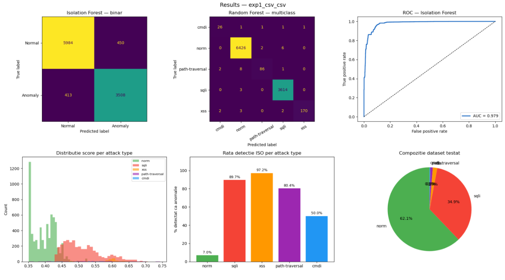
#### CSV_LOG
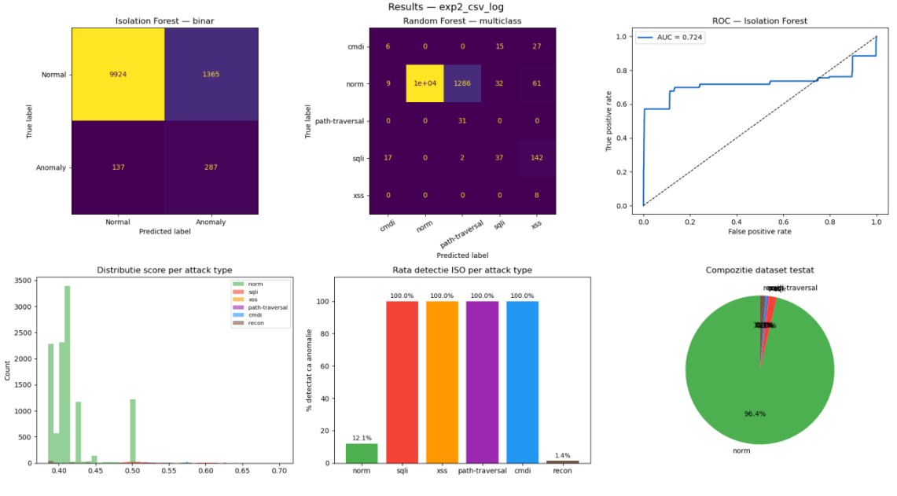
#### LOG_CSV
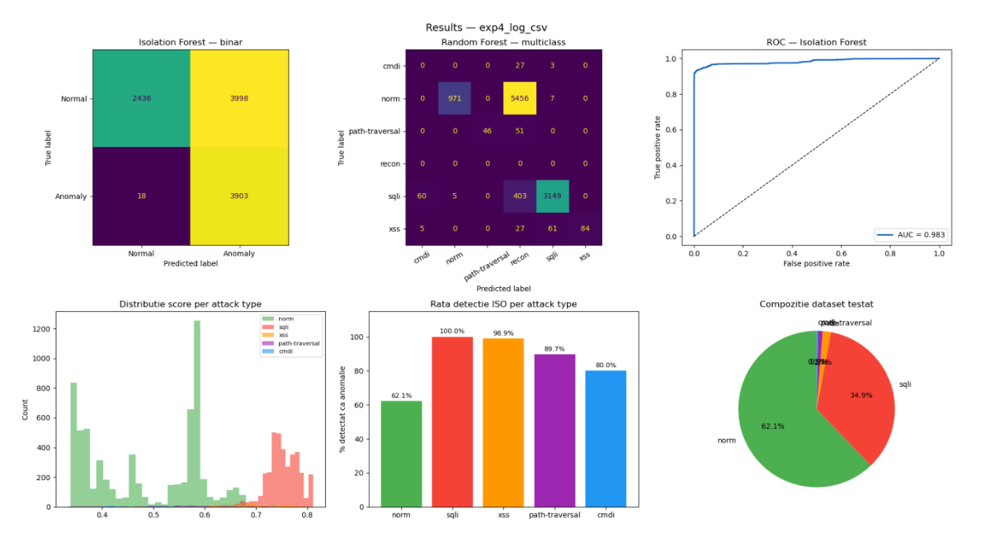
#### LOG_LOG
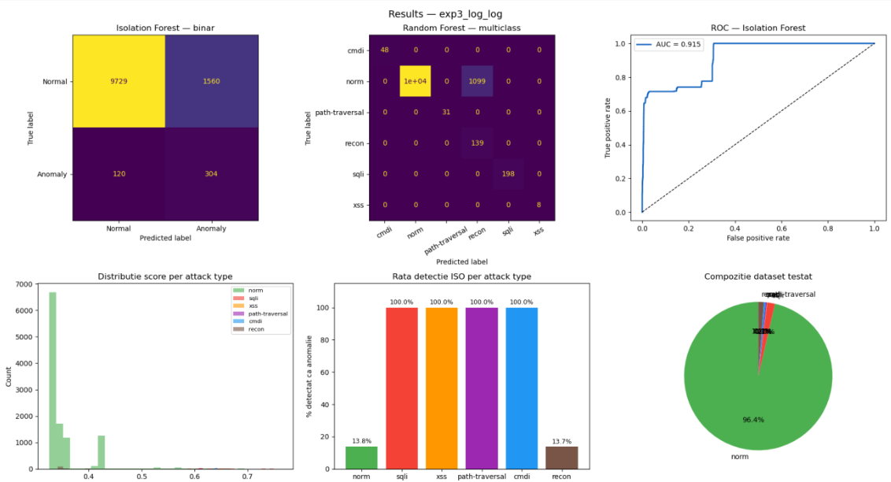

### `anomaly_detector_threshold.py` — Isolation Forest cu threshold optim (f1)

| # | Antrenare | Testare | Threshold | ISO Accuracy (default) | ISO Accuracy (optim) | RF Accuracy |
|---|---|---|---|---|---|---|
| Exp. 1 | CSV | CSV | 0.4393 | 0.92 | 0.92 | 1.00 |
| Exp. 2 | CSV | LOG | 0.4990 | 0.87 | 0.98 | 0.86 |
| Exp. 3 | LOG | LOG | 0.5906 | 0.86 | 0.98 | 0.91 |
| Exp. 4 | LOG | CSV | 0.6728 | 0.61 | 0.97 | 0.41 |
| Exp. 5a | MIXED | CSV | 0.4761 | 0.81 | 0.96 | 0.99 |
| Exp. 5b | MIXED | LOG | 0.5110 | 0.97 | 0.98 | 0.91 |

#### CSV_CSV
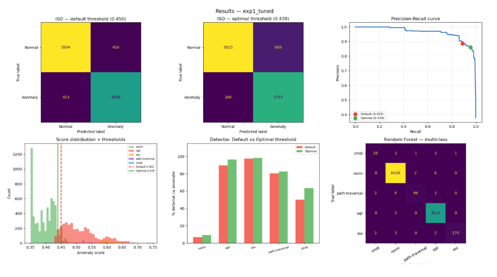
#### CSV_LOG
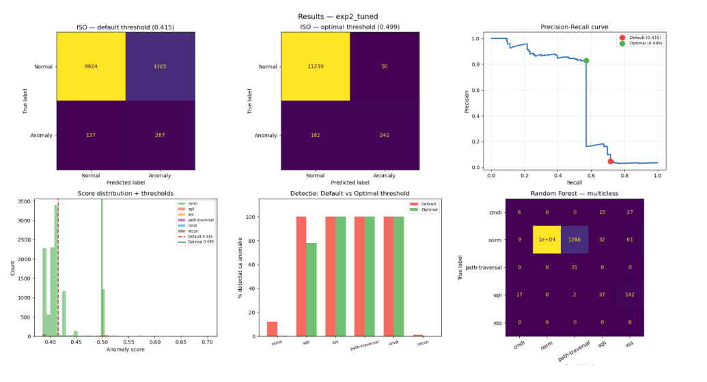
#### LOG_CSV
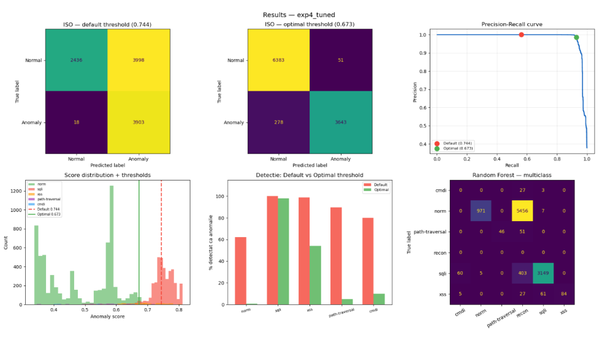
#### LOG_LOG
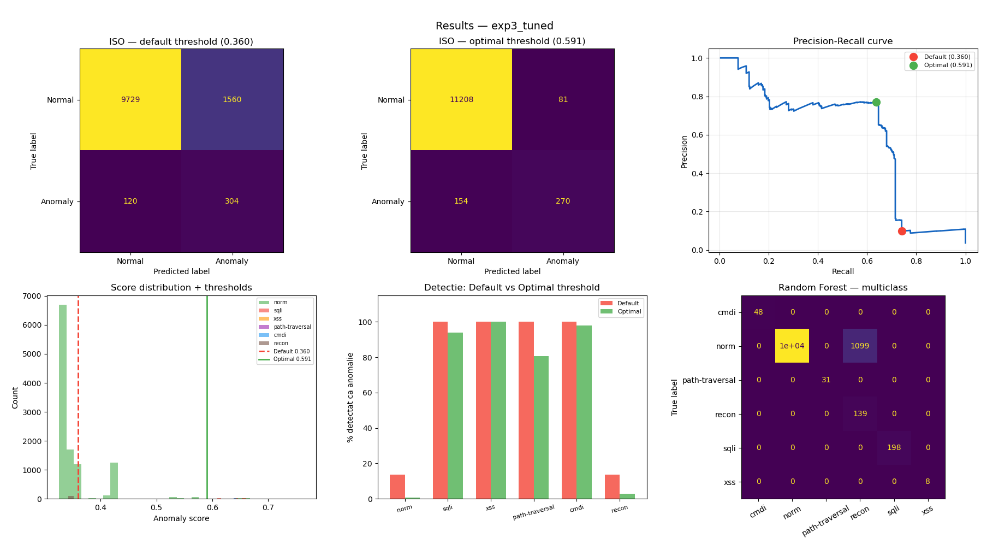
#### MIXED_CSV
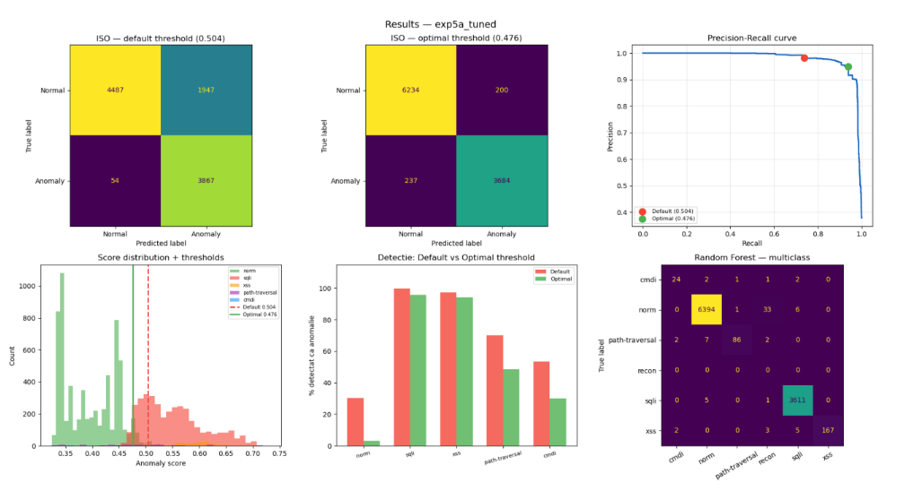
#### MIXED_LOG
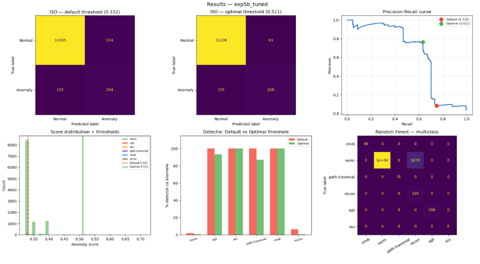

### `anomaly_detector_combined.py` — RF Accuracy (modul MIXED)

| # | Antrenare | Testare | ISO Accuracy | RF Accuracy | Macro F1 (RF) |
|---|---|---|---|---|---|
| Exp. 5a | MIXED | CSV | 0.99 | 0.99 | 0.79 |
| Exp. 5b | MIXED | LOG | 0.91 | 0.91 | 0.86 |

#### MIXED_CSV
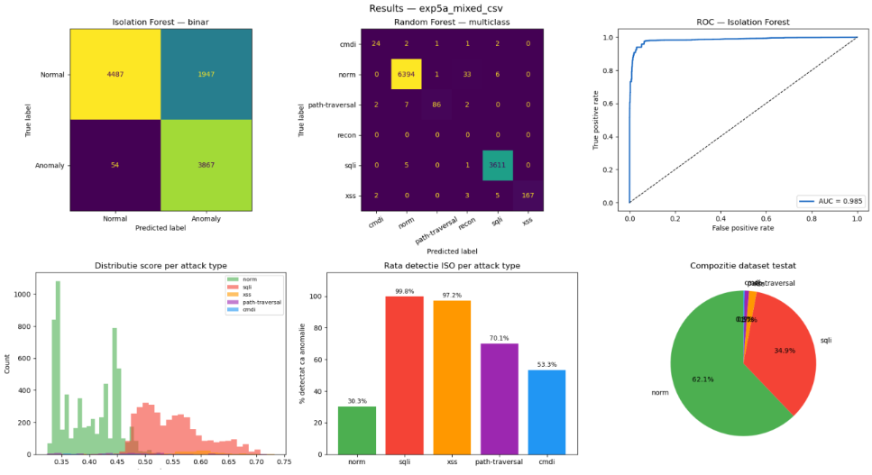
#### MIXED_LOG
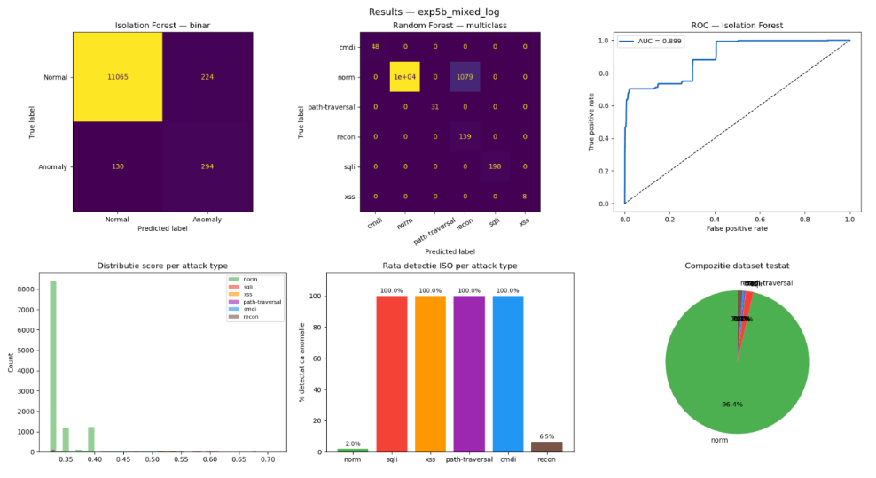
